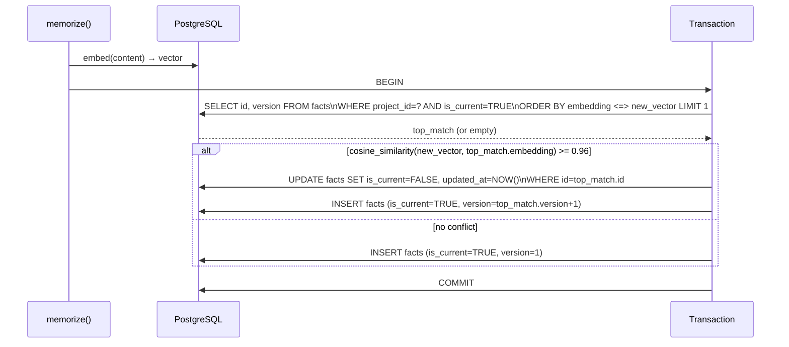
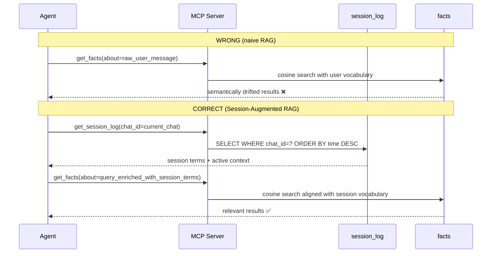
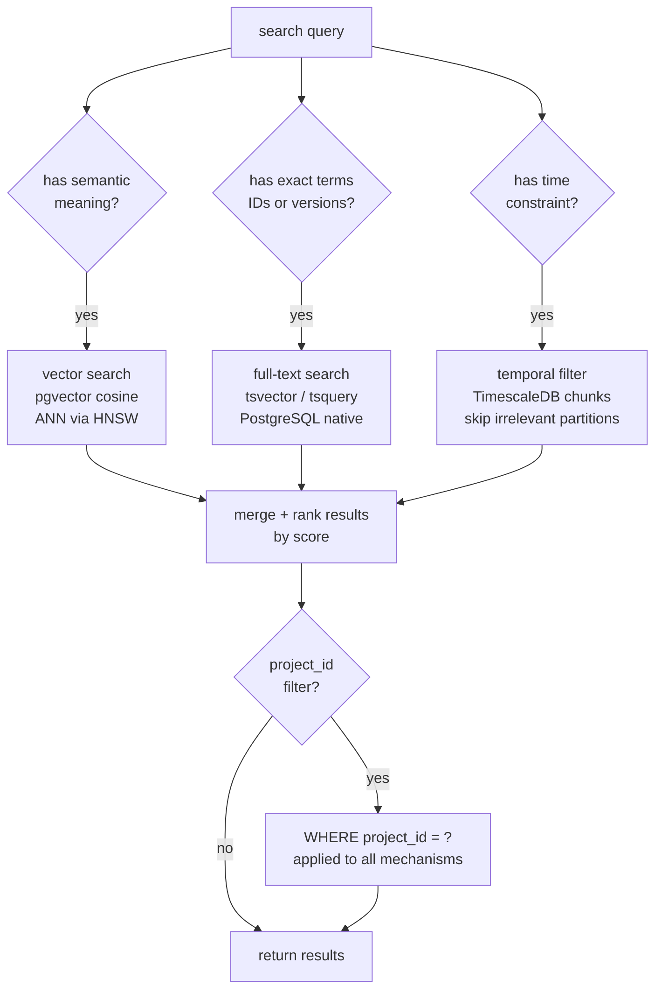
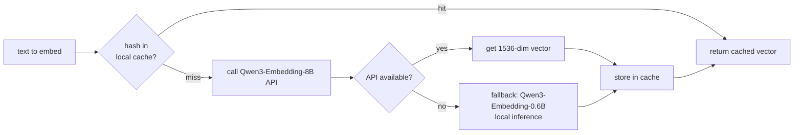

# SKILL: mlms-patterns

Load this skill when: implementing conflict detection, Session-Augmented RAG, hybrid search, or any business logic in `storage/` or `search/`.

---

## Pattern 1 — Conflict Detection (FR-7)

Triggered automatically inside `memorize(type="fact")`.

Critical: the UPDATE + INSERT must be atomic (single transaction). Non-atomic = race condition.
`COSINE_CONFLICT_THRESHOLD = 0.96` is a starting calibration point — add a config override for tuning in section 2.4 tests.

---

## Pattern 2 — Session-Augmented RAG (original pattern)

The naive approach causes semantic drift: agent queries facts with user-message vocabulary, which may not match stored fact vocabulary → wrong results.

Step 1 (`get_session_log`) is mandatory before Step 2 (`get_facts`) whenever the agent needs semantic memory in an active session. The session log acts as a vocabulary bridge between user intent and stored facts.

---

## Pattern 3 — Hybrid Search Routing (FR-6)

Three independent mechanisms, combinable in any subset:

Implementation note: each mechanism is independently applied, then results are merged. The `project_id` WHERE clause is always applied at SQL level — never filter in Python after the query.

---

## Pattern 4 — Embedding Cache

Semantic caching reduces API calls by 61-68% depending on query category.

Cache key: `sha256(text + model_name)`. Store in Redis with same TTL as session or longer.
Always log which path was taken (API vs fallback) — needed for NFR-1 latency split reporting.

---

## Acceptance Criteria (for test verification loops)

| Check | How to verify |
|---|---|
| All 7 tools return JSON Schema-valid responses | `pytest tests/integration/test_tool_schemas.py` |
| Latency p99 < 200ms cached path | `pytest tests/benchmark/ --benchmark-only` |
| Latency cold path measured separately | same benchmark, separate fixture with cache cleared |
| Recall@5 > 80% | `pytest tests/benchmark/test_precision.py --dataset fixtures/synthetic_100.json` |
| Conflict detection is atomic | `pytest tests/unit/test_conflict_detection.py` — includes concurrent write test |
| FR-8 export/import 0 loss | `pytest tests/integration/test_export_import.py` |
| Docker Compose cold start works | `./scripts/init_db.sh && pytest tests/smoke/` |
