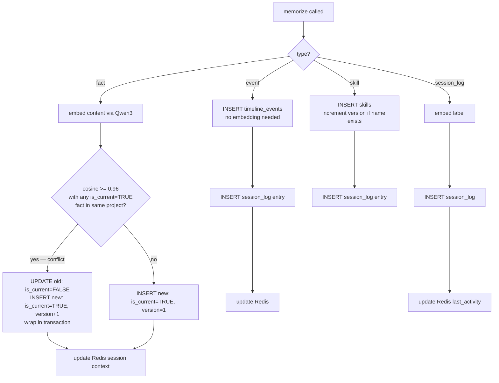

# CLAUDE.md — MLMS

MLMS is a self-hosted MCP server giving LLM agents persistent cross-session memory across 4 CoALA layers.
Single rule: **LLM client never touches the DB directly. All access goes through MCP tools.**

---

## Behavioral Rules (Karpathy Principles)

1. **Don't assume** — when intent is ambiguous, surface the tradeoff and ask. Never silently pick an interpretation.
2. **Minimum code** — solve only what was asked. No speculative features, no single-use abstractions. If 50 lines works, don't write 200.
3. **Surgical changes** — touch only what the task requires. Don't refactor adjacent code. Don't "improve" comments. If you notice unrelated dead code, mention it — don't delete it.
4. **Goal-driven loops** — when given success criteria, verify them before stopping. Don't report done until tests pass.

---

## Key Constants — never change without explicit instruction

```python
EMBEDDING_DIM            = 1536       # identical across ALL vectorized tables — non-negotiable
                                      # Matryoshka truncation of Qwen3-Embedding-8B (4096→1536)
                                      # 1536 < pgvector HNSW limit of 2000 — enables HNSW in pgvector 0.8.x
EMBEDDING_MODEL          = "qwen3-embedding-8b"
EMBEDDING_FALLBACK       = "qwen3-embedding-0.6b"

COSINE_CONFLICT_THRESHOLD = 0.96      # calibration starting point only — NOT a fixed production param
                                      # requires independent calibration for Qwen3-Embedding-8B

REDIS_SESSION_TTL        = 172800     # 48 hours. 86400 (24h) is WRONG — do not use
REDIS_KEY_PATTERN        = "session:{chat_id}"

LATENCY_P99_TARGET_MS    = 200        # cached path only
LATENCY_SESSION_CTX_MS   = 5         # get_session_context() hard limit
PRECISION_AT_5_TARGET    = 0.80      # Recall@5 metric: доля сценариев где relevant факт попал в top-5
                                      # (переименовано из precision@5 — sparse ground truth, 1-2 relevant per scenario)
```

---

## System Architecture

```mermaid
graph TD
  LLM[LLM Client] -->|MCP JSON-RPC only| Server[MCP Server + Business Logic]
  Server --> EmbAPI[Qwen3-Embedding-8B\nAlibaba Cloud API]
  Server --> PG[(PostgreSQL\npgvector + TimescaleDB)]
  Server --> RD[(Redis)]

  PG --> F[facts\nSemantic Memory]
  PG --> TE[timeline_events\nEpisodic / project scale]
  PG --> SL[session_log\nEpisodic / chat scale]
  PG --> SK[skills\nProcedural Memory]
  RD --> SC[session:{chat_id}\nWorking Memory]
```

---

## memorize() Routing



---

## Implementation Order — respect architectural dependencies

Step 1 — `docker-compose.yml` (postgres with pgvector+timescaledb extensions, redis)
Step 2 — alembic migrations (5 tables + hypertables + HNSW indexes)
Step 3 — `embedding.py` (Qwen3 API + fallback + semantic cache)
Step 4 — `storage/facts.py` (conflict detection + is_current logic + ACID transaction)
Step 5 — `storage/timeline.py` (hypertable inserts + temporal range queries)
Step 6 — `storage/session_log.py` (in-session reads + cross-session cosine search)
Step 7 — `storage/session_ctx.py` (Redis hash + EXPIRE on every access)
Step 8 — `storage/skills.py` (versioning: increment version, never DELETE)
Step 9 — `tools/memorize.py` (routes to correct storage layer per type)
Step 10 — `tools/get_*.py` (6 read tools)
Step 11 — `tools/search_memory.py` (cross-layer search — needs all layers ready)
Step 12 — `server.py` (register all 7 tools, start MCP server)
Step 13 — `tests/` (unit + integration + 100-scenario benchmark)

---

## Anti-Patterns — things Claude gets wrong on this project

- Using `86400` for Redis TTL — always use `REDIS_SESSION_TTL = 172800`
- Different embedding models on different tables — breaks cosine similarity (different vector spaces)
- Physical DELETE on facts — use `is_current=FALSE` (soft delete preserves version history)
- Conflict detection outside a transaction — race condition, must be atomic
- Using `semantic_query` in `get_session_log` WITH a `chat_id` — these are two distinct modes, not combinable
- Treating `COSINE_CONFLICT_THRESHOLD = 0.96` as immutable — always note it needs calibration
- Hard-coding tool count, FR count, NFR count — anchors: 7 tools, 8 FR, 5 NFR
- Writing `ALTER TABLE` for new event metadata — use the existing `metadata JSONB` column
- Comparing vectors from different embedding model outputs — meaningless cosine values
- Over-commenting — write self-documenting code. Comments only for non-obvious WHY, never for WHAT. No docstrings on obvious functions. No "# Initialize the connection" above connection = connect(). Code should read like written by a developer, not explained to one.
- Using `vector(4096)` or `vector(2048)` for embeddings — EMBEDDING_DIM = 1536 (Matryoshka truncation of Qwen3-4096); HNSW limit in pgvector 0.8.x = 2000, so 1536 is the correct value
- VECTOR(4096) в схемах → всегда VECTOR(1536) (pgvector 0.8.2 HNSW лимит = 2000)

---

## Key Decisions Log

All non-obvious architectural decisions (index type changes, schema trade-offs, library limitations)
must be recorded in `key_decisions.md` at the project root.
Format: date, decision, reason, alternatives rejected, affected files, trade-offs.

---

## Context Compaction Hints

When `/compact` runs (manually or auto), always preserve:
- Which of steps 1–13 are complete (list them by number)
- Current alembic head revision (e.g. `005_create_skills`)
- Failing test names + one-line error summary if any tests are broken
- Latest benchmark numbers: p99 cached path ms + Recall@5 score
- `REDIS_SESSION_TTL = 172800` (not 86400 — easy to lose after compaction)

Use `/compact focus on <topic>` rather than letting auto-compact fire silently.

---

## Session Strategy

One session = one architectural layer. Don't mix concerns across layers in one session.

```
Steps 1–2   docker-compose + migrations   → /clear when done
Steps 3–4   embedding + facts             → new session, hint: "steps 1-2 done, alembic head 005"
Steps 5–8   storage layers               → new session every 2 steps
Steps 9–11  tools                        → use subagent per tool (context stays clean)
Steps 12–13 server + tests               → one final session
```

For heavy isolated work (benchmarks, migration review) → delegate to subagents in `.claude/agents/`.
Quick one-off questions that shouldn't pollute context → use `/btw` (answer appears inline, never enters history).

---

## Note on Diagrams

Mermaid diagrams live in `.claude/skills/mlms-patterns/` — for Claude Code to reason about architecture.
ASCII sequence diagrams live in `docs/chapter2_brief.md` — for the diploma thesis text only.
These are intentionally different formats for different audiences. Do not merge or replace either.

---

## Skills — load these when relevant

- **mlms-schemas** — when writing migrations, touching schema, or implementing any storage layer
- **mlms-tools** — when implementing or testing any of the 7 MCP tools
- **mlms-patterns** — when implementing conflict detection, Session-Augmented RAG, or hybrid search

---

## Directory Layout

```
mlms/
├── CLAUDE.md
├── docker-compose.yml
├── pyproject.toml
├── alembic/versions/          001–005 migrations
├── src/mlms/
│   ├── server.py              MCP entry point, 7 tools registered
│   ├── config.py              all constants above
│   ├── embedding.py           API + fallback + cache
│   ├── storage/               facts, timeline, session_log, session_ctx, skills
│   ├── search/                vector, fulltext, temporal, hybrid
│   └── tools/                 memorize, get_facts, get_timeline, get_session_log,
│                              get_session_context, get_skills, search_memory
├── tests/unit/ integration/ fixtures/synthetic_100.json
└── scripts/init_db.sh  seed_test_data.py
```

---

Respond terse like smart caveman. All technical substance stay. Only fluff die.

Rules:
- Drop: articles (a/an/the), filler (just/really/basically), pleasantries, hedging
- Fragments OK. Short synonyms. Technical terms exact. Code unchanged.
- Pattern: [thing] [action] [reason]. [next step].
- Not: "Sure! I'd be happy to help you with that."
- Yes: "Bug in auth middleware. Fix:"

Switch level: /caveman lite|full|ultra|wenyan
Stop: "stop caveman" or "normal mode"

Auto-Clarity: drop caveman for security warnings, irreversible actions, user confused. Resume after.

Boundaries: code/commits/PRs written normal.